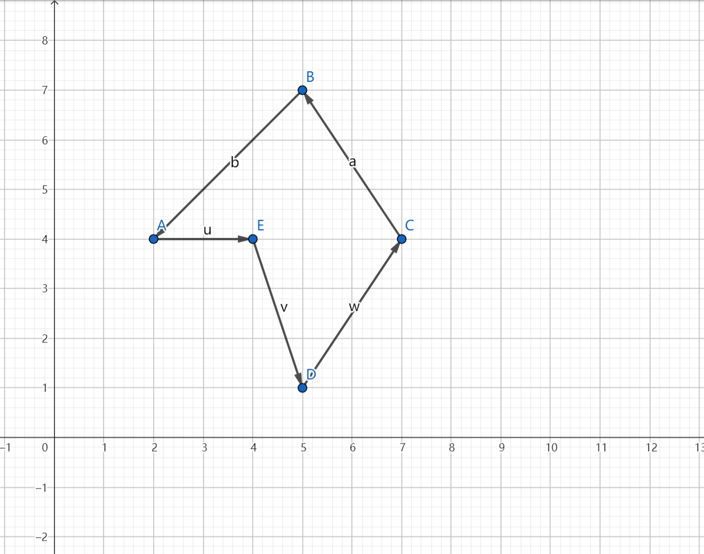
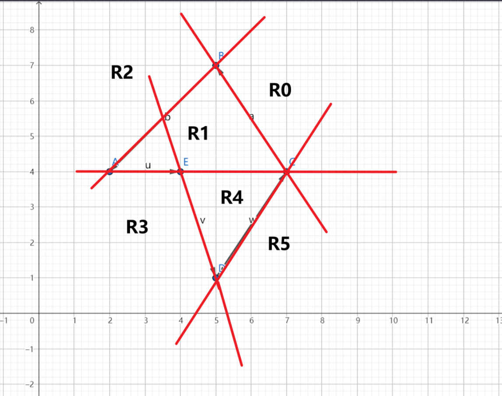
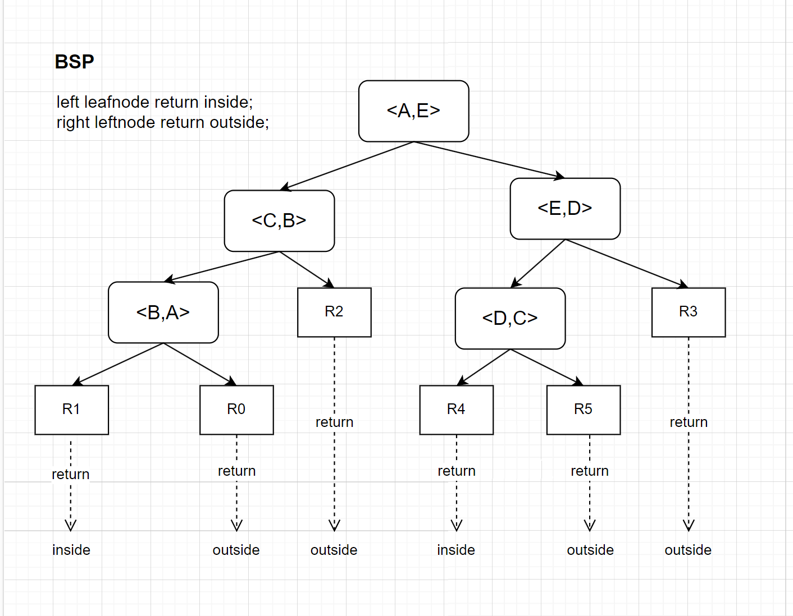
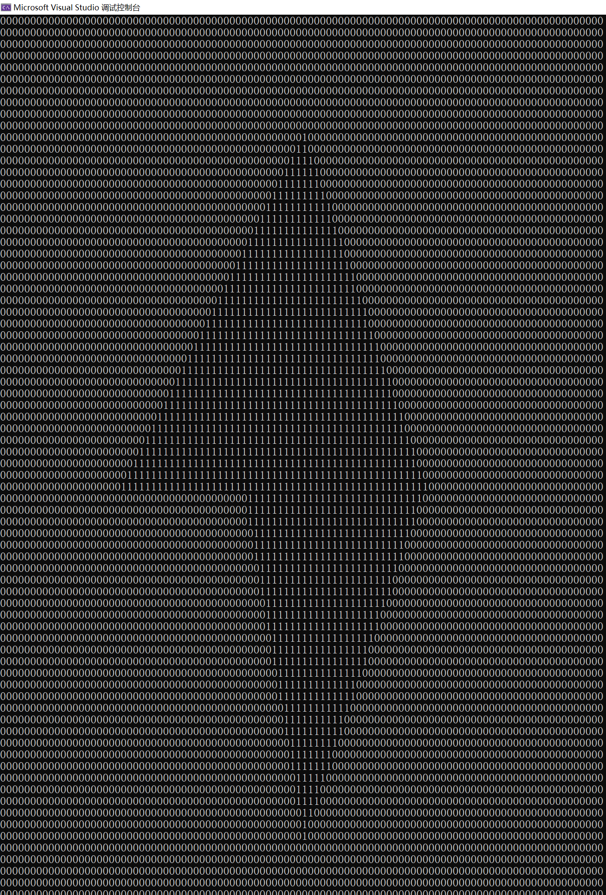
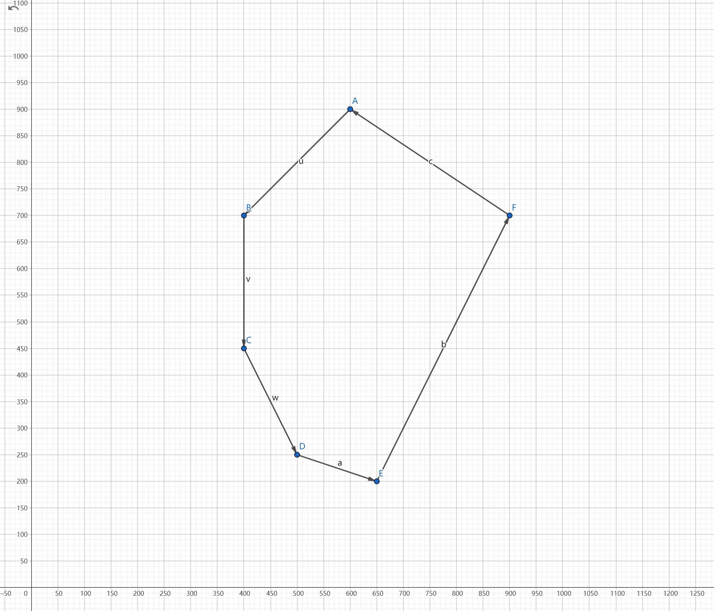
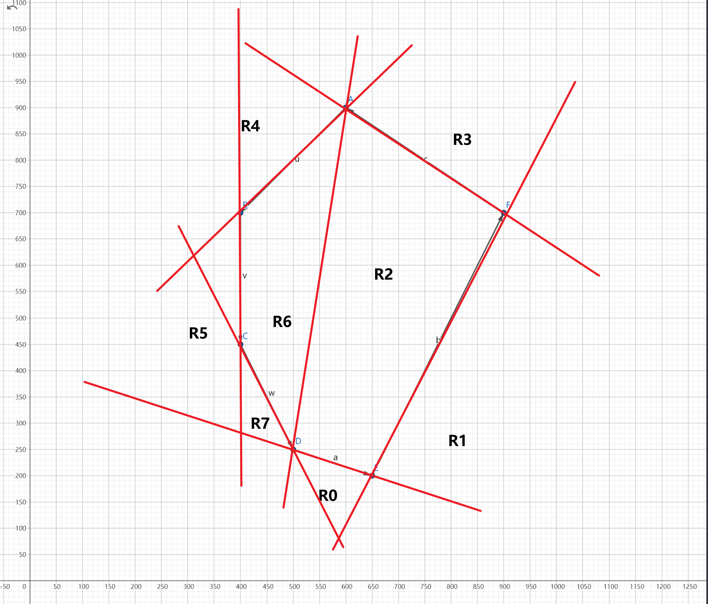
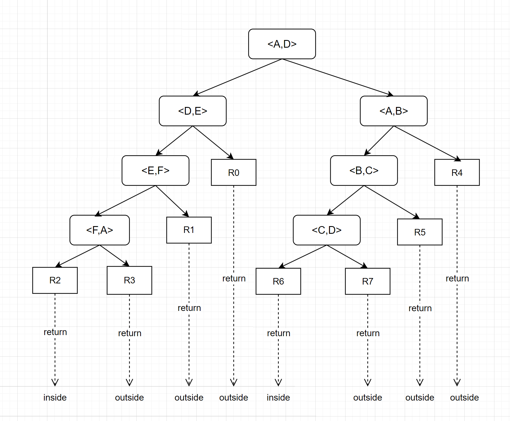
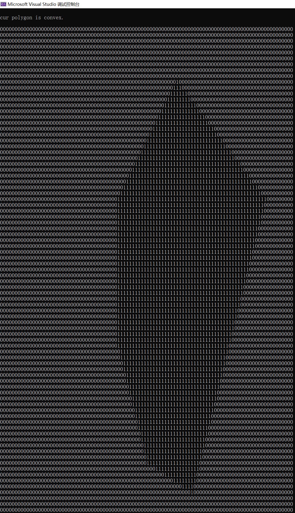
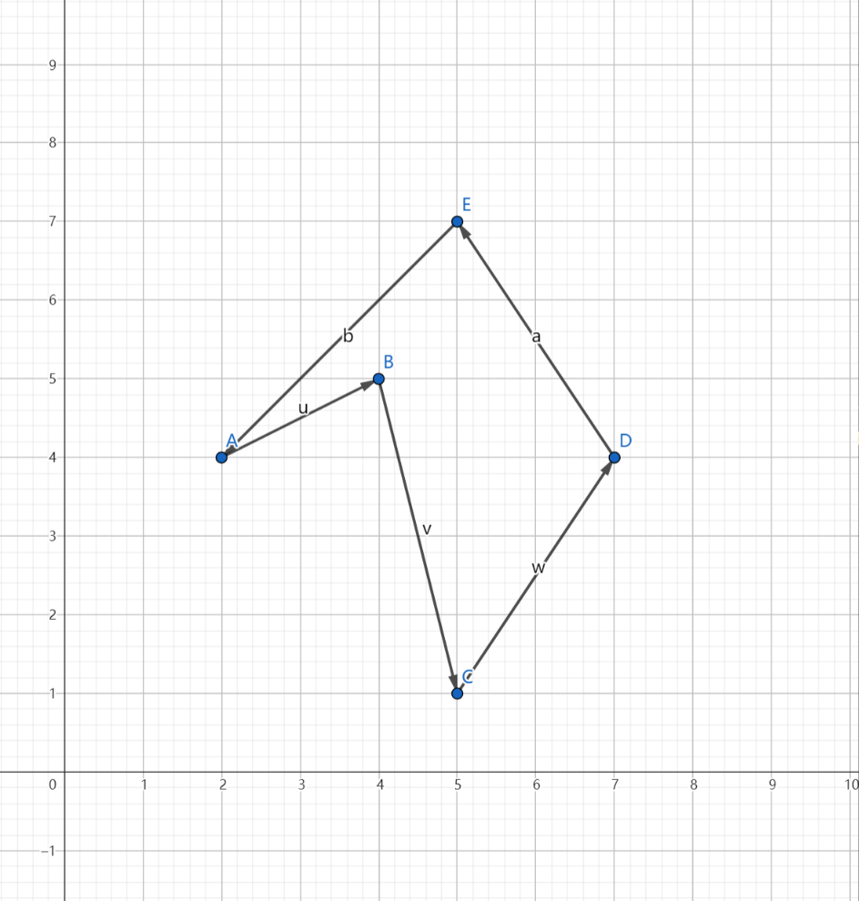
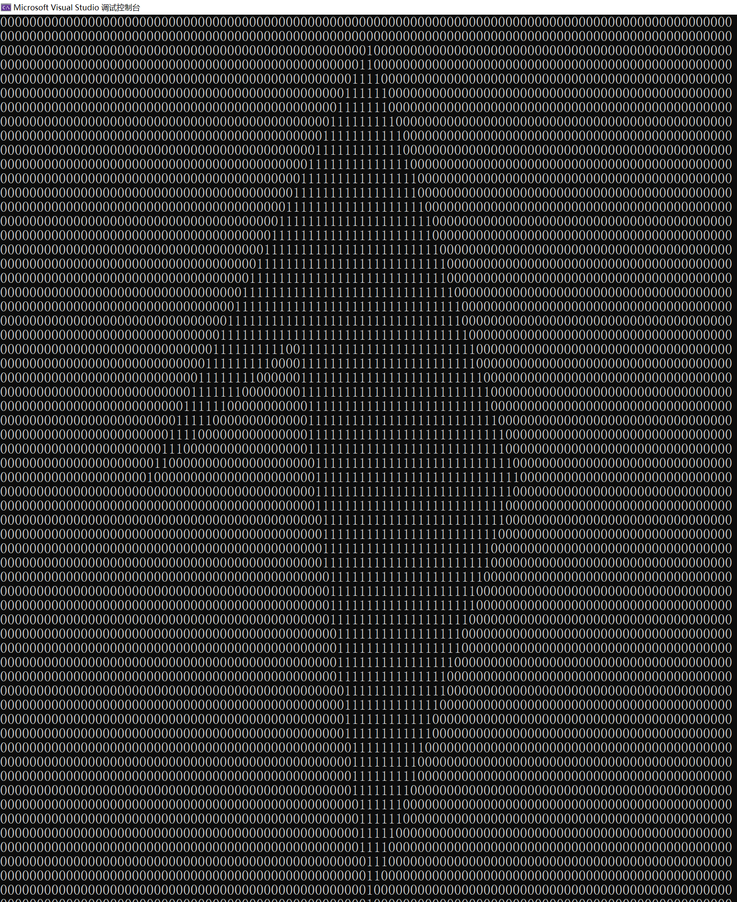

# Author

yudong.lin

2023.09.26

# Tips

* 使用BSP完成任意多边形点阵的激活, 零依赖第三方库
* 编译的可执行文件 ./myproject.exe (为方便把可执行文件复制到了根目录)
* ./build/Debug/myproject.exe 为编译后的重新生成可执行文件
* 重新编译时清清空./build文件夹下文件，在build下执行cmake后重新编译
* ./script/build.bat 为编译./CMakeList.txt 脚本，./script/run.bat 为运行myproject.exe并持久化到./dot.data 脚本
* ./dot.data 为输出的持久化文件
* 为了可视化输出容易观察，使用的是100*100的点阵，要修改点阵大小，只需要修改 ./main.cpp下 N的宏

  ```
  #define N 100
  ```

---

# Desc

Question: 对于 1000x1000 的 规则点阵， 左下角坐标为 0，0， 相邻点的距离为 1； 给出算法，对于给定的一个多边形，把多边形内的那些点标记为 1；

Solution: BSP

1. 判断是否凸包
2. convex：二分split；concave：边分割

Test:

```
std::vector<pair<double,double>> dots{{20,40}, {40,40}, {50,10}, {70,40}, {50,70}};
```









`std::vector<pair<double,double>> dots{{600,900}, {400,700}, {400,450}, {500,250}, {650,200}, {900,700}};`









`vector<pair<double,double>> concaveDots1{{20,40}, {40,50}, {50,10}, {70,40}, {50,70}}; `




